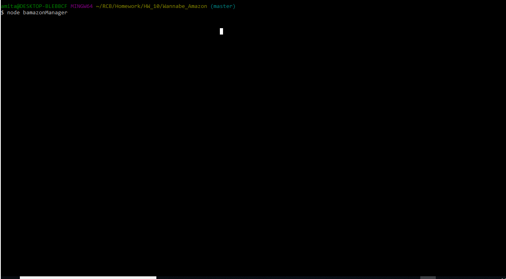
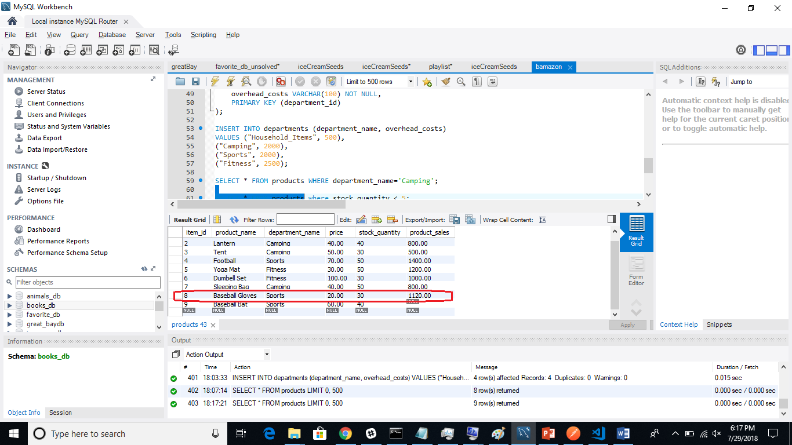

# Wannabe_Amazon

<b>Bamazon Customer</b> 
In the customer site, first we see below a snapshot of the products table. Note the stock quantities and product sales columns for item ids 5 and 8 

After customer purchases item ids 5 & 8, worth 10 units each see the updated quantities in stocks and increased product sales for these 2 items. 
see below the gif for the bamazonCustomer application showing the purchase happening...

Finally please see the updated values of stock quantity and product sales after the 2 purchases for those 2 items 
 

<b>Bamazon Manager</b> 
Please see below gif to see how there are diffent options for Manager to see all products, view low inventory, update inverntory for existing product and also add new products! 
We see that after customer purchase 26 units of item id=8, the product sales $ increased to $1120 i.e. ($600 + (26*$20)). The quantity depleted to only 4 and then using the add Inventory option , again added 26 units to increase the stock quantity to 30.
 
After the manager transactions, see the record for updated product sales for item id=8.

