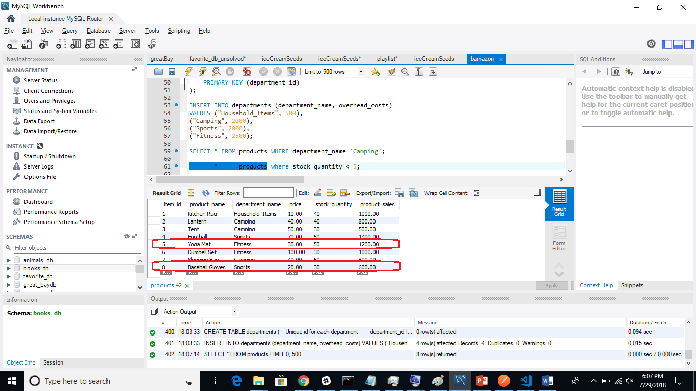

# Wannabe_Amazon

Bamazon Customer 
In the customer site, first we see below a snapshot of the products table. Note the stock quantities and product sales columns for item ids 5 and 8 

After customer purchases item ids 5 & 8, worth 10 units each see the updated quantities in stocks and increased product sales for these 2 items. 
see below the gif for the bamazonCustomer application showing the purchase happening...

Finally please see the updated values of stock quantity and product sales after the 2 purchases for those 2 items 

